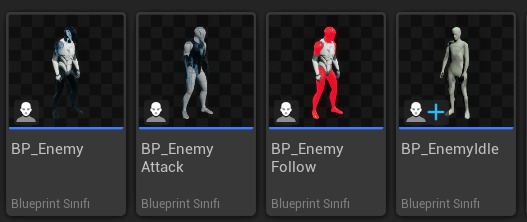
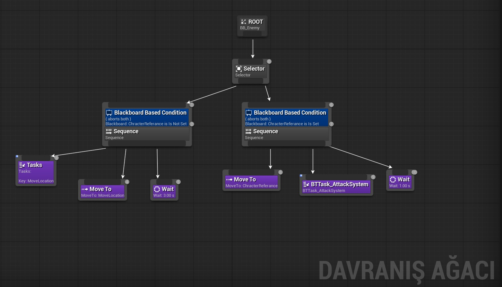
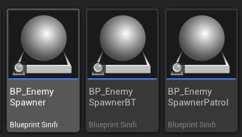
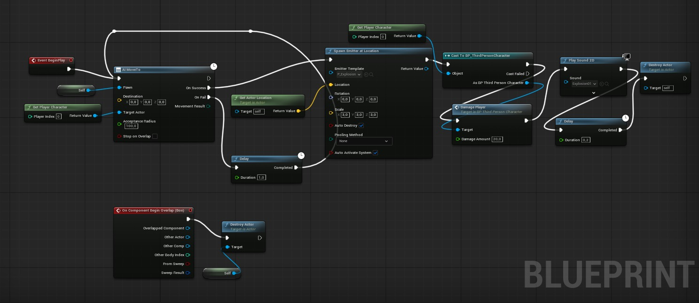
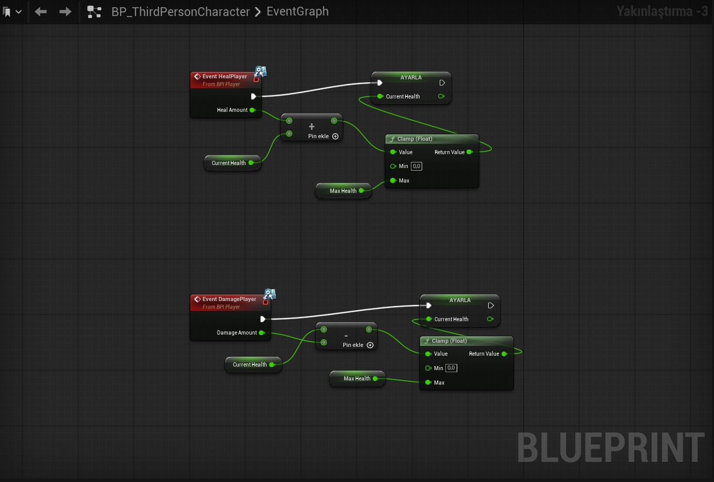
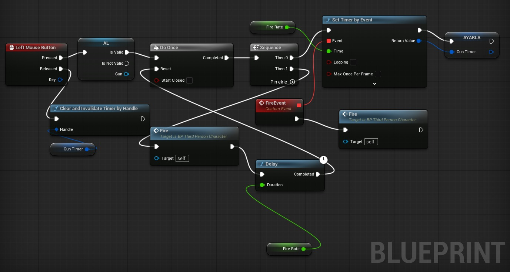
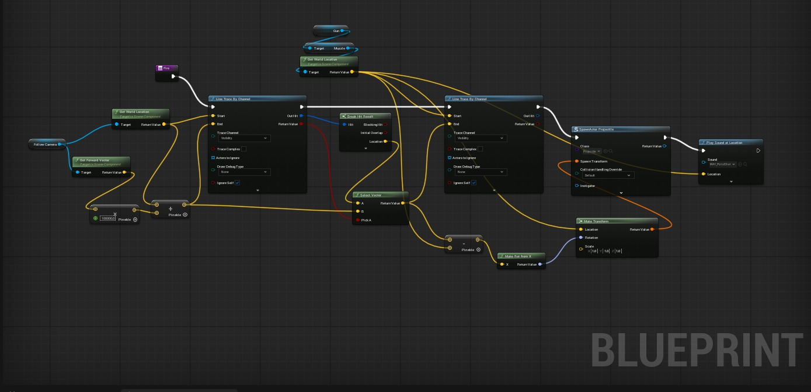
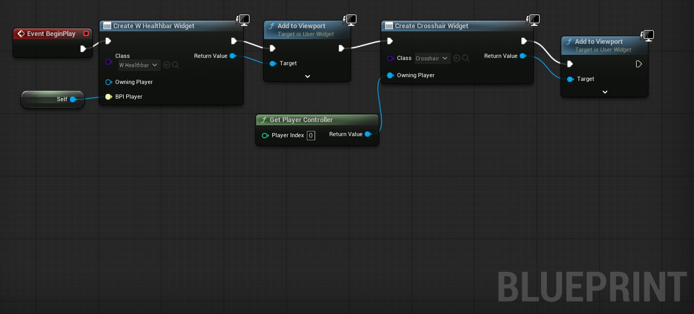
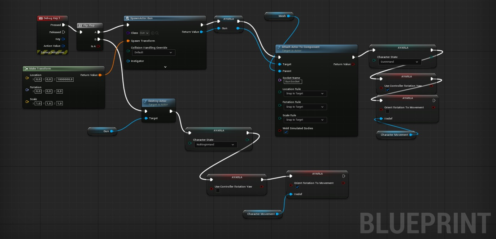

### EyvahPolis oyunu

Bir TPS-Survival oyunu

Proje, Unreal Engine 5 motoru üzerinde C++ ve Blueprint hibrit mimarisi kullanılarak geliştirildi. Projenin ana hedefi, kapalı bir kumarhane haritasında, oyuncuyu kovalayan ve yakaladığında patlayarak hasar veren yapay zeka (NPC) dalgalarına karşı oyuncunun hayatta kalmasını sağlamaktır. Oyuncular, NPC'leri vurarak ve haritadaki can paketlerini toplayarak hayatta kalma sürelerini uzatmaya çalışır.

## 1) Sistemin Mimarisi

Sistem, UE5'in Aktör-Bileşen (Actor-Component) modelini temel almakta. Bu, yeniden kullanılabilir ve modüler bir kod yapısı sağlar.

### Oynanış (Blueprints):

*   `BP_Player`:  Kamera ayarları, silah mesh'i ve animasyonlar burada yönetilir.
    
*   `BP_EnemyFollow`:  NPC'nin mesh'i, patlama efekti ve patlama hasar miktarı gibi tasarımsal değerler buradan ayarlanır.
    
*   `BPI_Abilities`:  Ne kadar can vereceği ve mesh'i burada belirlenir.
    

### Yapay Zeka (AI Modülü):

NPC'lerin oyuncuyu kovalaması için UE5'in Behavior Tree ve AIPerception sistemini kullandık.

## Oyun Mekaniklerimiz

### NPC (Yapay Zeka) Varlıkları

Projede kullanılan ana düşman, kovalama ve bekleme durumları için kullanılan Blueprint sınıfları.

### Davranış Ağacı (Behavior Tree)

Yapay zekanın oyuncuyu algıladığında (Blackboard "CharacterReference" Is Set) veya algılamadığında (Is Not Set) nasıl davranacağını belirleyen mantık.

### NPC Spawner ve Kovalama Mantığı

Düşmanları oluşturan NPC'nin oyuncuyu yakaladığında patlayıp hasar vermesi ve kendini yok etmesi

### Oyuncu Mekanikleri (Can, Ateş Etme, Arayüz)

Oyuncunun can ve hasar almasını yöneten Blueprinti

Oyuncunun "Sol Mouse Tuşu" ile ateş etmesini sağlayan fonksiyon

Ateş etme fonksiyonu

Oyun başladığında oyuncunun ekranına can barı ve nişangah ekleme

### Silah Mekaniği

"1" tuşuna basıldığında silahı oluşturan ve oyuncunun eline bağlayan mantık.

## 3) Arayüzler

*   **Ana Menü:** Başlat ve çıkış butonları
    
*   **Oyun İçi Arayüz (HUD):**
    
    *   Sol üstte oyuncunun `UHealthComponent`'a göre değişen bir can barı
      
*   **Ölüm Ekranı:** Oyuncunun canı sıfırlandığında beliren,"Öldün" yazdıran ekran
    

## 4) Literatür Taraması ve Karşılaştırma

Projemiz, "Arcade-Survival" ve "FPS/TPS Shooter" türlerindeki oyunların mekaniklerini referans almıştır.

*   **Örnek 1: Serious Sam :** "Beheaded Kamikaze" düşman tipi projemizdeki NPC'lerle benzer. Bu düşmanlar oyuncuya doğru koşar ve yakın mesafede patlar.
    
*   **Örnek 2: Minecraft:** Benzer şekilde, "Creeper" adlı NPC de oyuncuyu takip eder, yaklaştığında patlar.
    
*   **Örnek 3: Call of Duty: Zombies (Oyun Döngüsü):** Kapalı bir haritada sürekli gelen düşman dalgalarına karşı hayatta kalma, kaynak yönetimi ve harita içerisinde hareket etme zorunluluğu bulunması
    

## Kullanılan Yazılımsal Mimariler, Yöntemler ve Teknikler

### Mimari: Aktör-Bileşen

**Uygulama:** `UHealthComponent` kullanımı bu mimarinin en net örneğidir. `TakeDamage()` fonksiyonu çağrıldığında, canı azaltır ve can sıfırsa `OnDeath` adında bir `Delegate` tetikler. Oyuncu öldüğünde "Öldünüz" ekranı bu `Delegate`'e bağlanarak çağrılır.

### Yapay Zeka Yöntemi (Behavior Trees)

**Uygulama:** NPC'lerin kumarhane haritasındaki slot makineleri ve masalar gibi engellere takılmadan oyuncuyu bulabilmesi için haritada yürünebilir alanlar oluşturuldu. Behavior Tree'de NPC, `AIPerception` ile algılanan oyuncuyu `MoveTo` komutuyla takip eder.

### Teknik: Olay Çakışması (Overlap Events) ile Toplama

## 7) Karşılaşılan Zorluklar ve Çözümler

*   **Zorluk 1: Projelerin birlestirilmesi** Projeyi ayri sekillerde mekanikleri maplari gelistirdik bu mekaniklerin ve assetlerin aktarilmasi kisminda bazen oyun dosyalarimiz bozuldu ve tekrardan mekanikleri olusturmak durumunda kaldik.
    
*   **Zorluk 2: Animasyon Ekleme , Olusturma, aim ofset** Karakterimiz eline silahi aldiginda aim offseti oluşturmak için animasyon yapisini blendleyerek bir system oluşturduk. Bu kisimda bir cok kez bozulmalar yasandi. Genel olarak hazir animasyon kullanmadikca animasyonlari yonetmek mesakatli bir surec oldu.
    
*   **Zorluk 3: Silah Mekaniği Eklenirken Yaşanan Zorluklar** (Not: Orijinal metinde 2 adet "Zorluk 2" vardı, bunu 3 olarak düzelttim) Oyuncuya silah mekaniğini eklerken silah actorünü ayarlamak isterken bazı hatalarla karşılaştık. Silahı oyuncunun eline gelecek şekilde ayarlasak bile hatadan dolayı kullanıcının gövdesinde gözüküyordu.
    

## 8) Sonuç ve Kişisel Kazanımlar

"EyvahPolis" oyununda , hedeflenen tps-survival oyun döngüsünü oluşturan bir prototip oluşturmaya çalıştık. Oyuncunun sürekli hareket etmeye zorlandığı bir oyun oldu.

Bu projenin bize kattıkları:

1.  **Yapay Zeka Navigasyonu:** Küçük ve engellerle dolu bir haritada NavMesh oluşturma konusunda deneyim kazandık.
    
2.  **Olay Yönelimli Programlama:** Delegates ve Overlap Events kullanarak sistemleri (sağlık, UI, patlama gibi) birbirine bağlamak için çaba sarf ettik.
    
3.  **UE5 Fizik ve Hasar Sistemleri:** Oyun motorunun imkanlarını ve zorluklarını kullanarak öğrenmiş olduk.
    
4.  **Oyun Döngüsü Tasarımı:** Bir oyunun temel risk ve ödül mekaniklerinin nasıl dengeleneceği konusunda pratik yapmış olduk.
